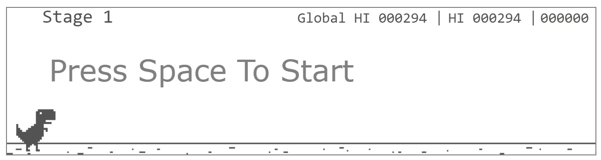

# Websocket Dino

## 개요

이 프로젝트는 Node.js와 Redis를 사용해 Chrome 브라우저의 Dino 게임을 구현한 프로젝트입니다.

## 기술 스택

-   **Node.js**: 서버 사이드 자바스크립트 실행 환경
-   **Redis**: 게임 플레이 데이터 저장
-   **AWS EC2**: 배포 플랫폼

## 프로젝트 설치 및 실행

### 요구 사항

-   Node.js
-   npm
-   Redis

### 설치

1. **레포지토리 클론**

    ```bash
    git clone https://github.com/Ayumudayo/Websocket_Dino.git
    cd Websocket_Dino
    ```

2. **의존성 설치**

    ```bash
    npm install
    ```

3. **환경 변수 설정**

    `.env` 파일을 생성하고, 아래와 같은 환경 변수를 설정합니다.

    ```plaintext
    REDIS_HOST="YOUR REDIS HOST"
    REDIS_PORT=YOUR REDIS PORT
    REDIS_USERNAME="YOUR REDIS USERNAME" (Optional)
    REDIS_PASSWORD="YOUR REDIS PASSWORD"
    ```

4. **서버 실행**

    ```bash
    npm start
    ```

## 플레이 방법



### Stage

현재 스테이지를 나타냅니다.
특정 스코어를 달성할 때 마다 높은 스테이지로 이동합니다.

### Global HI

Redis에 저장된 가장 높은 스코어를 나타냅니다.

### HI

로컬에 저장된 하이 스코어를 나타냅니다.

그 오른쪽은 현재 스코어를 나타냅니다.

### 아이템

플레이 중에 스테이지에 따라 아이템이 등장합니다.
이 아이템을 획득하여 추가 점수를 얻을 수 있습니다.
